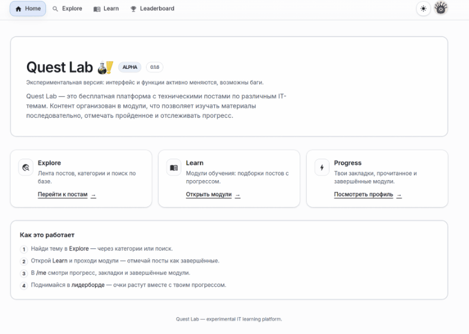

# Dev Pantry / Quest Lab

Dev Pantry is a client-server learning platform for publishing educational posts and grouping them into learning modules. It includes user accounts, admin-managed content, markdown editing, image uploads, post bookmarks/progress, module progress, categories, quizzes, and basic analytics/leaderboard features.



## Tech Stack

- **Frontend:** Next.js 16, React 19, TypeScript, Tailwind CSS 4, Material UI, Zustand, React Markdown, UIW Markdown Editor
- **Backend:** Rust, Axum, Tokio, SQLx, PostgreSQL, JWT authentication, Argon2 password hashing
- **Storage:** PostgreSQL for application data, local `backend/uploads` directory for uploaded files
- **Deployment:** Docker, Docker Compose, Caddy reverse proxy
- **Optional service:** `lab-manager`, a separate Rust service for managing short-lived Docker-based lab sessions

## Repository Structure

```text
backend/       Rust API server, migrations, upload handling
frontend/      Next.js web application
deploy/        Docker Compose and Caddy deployment files
infra/         Database migration notes and backup-related docs
lab-manager/  Optional isolated lab session manager
```

## Main Features

- Create, edit, publish, and delete posts
- Organize posts into modules, sections, and ordered module items
- Markdown-based post editing and preview
- Image upload support for posts, modules, and avatars
- User signup/login with JWT-based authentication
- Admin user bootstrapping from environment configuration
- Categories, bookmarks, reading completion state, module progress
- Post quizzes and text-input quiz support
- Leaderboard and analytics tracking endpoints

## Local Development

### Prerequisites

- Rust toolchain with Cargo
- Node.js 20+
- PostgreSQL 16 or compatible
- npm

### Backend

Create `backend/.env` locally. This file is ignored by git and must not be committed.

```env
SERVER_PORT=3001
DATABASE_URL=postgres://<user>:<password>@localhost:5432/<database>
JWT_SECRET=<development-secret>
JWT_LIFETIME_DAYS=7
ADMIN_PASSWORD=<admin-password>
```

Then run:

```bash
cd backend
cargo run
```

The backend listens on `http://localhost:3001` by default. SQLx migrations from `backend/migrations` are applied automatically on startup. The admin account is created or updated automatically using the configured `ADMIN_PASSWORD`.

### Frontend

For separate frontend/backend development, create `frontend/.env.local`:

```env
NEXT_PUBLIC_API_BASE_URL=http://localhost:3001/api
NEXT_PUBLIC_API_BASE_UPLOADS_URL=http://localhost:3001
```

Then run:

```bash
cd frontend
npm install
npm run dev
```

The frontend runs on `http://localhost:3000`.

## Docker Deployment

Use the sanitized compose example as a starting point:

```bash
cd deploy
cp docker-compose-example.yml docker-compose.yml
```

Replace placeholder values such as `<PASSWORD>` and `<JWT_SECRET>` in your local `docker-compose.yml`, then start the stack:

```bash
docker compose up --build -d
```

The compose setup starts:

- PostgreSQL
- Rust backend on internal port `3001`
- Next.js frontend on internal port `3000`
- Caddy reverse proxy on ports `80` and `443`

Caddy routes `/api/*` and `/uploads/*` to the backend, and all other requests to the frontend.

## Useful Commands

```bash
# Backend
cd backend
cargo fmt
cargo check
cargo run

# Frontend
cd frontend
npm run lint
npm run build
npm run dev

# Docker stack
cd deploy
docker compose up --build -d
docker compose logs -f
docker compose down
```

## Environment Variables

Backend:

- `APP_ENV` - use `prod`/`production` to disable `.env` loading and development CORS
- `SERVER_PORT` - API port, defaults to `3001`
- `DATABASE_URL` or `POSTGRES_CONN` - PostgreSQL connection string
- `JWT_SECRET` - secret used to sign JWT tokens
- `JWT_LIFETIME_DAYS` - token lifetime in days, defaults to `7`
- `ADMIN_PASSWORD` - password used to bootstrap/update the `admin` account
- `RUST_LOG` - Rust logging filter

Frontend:

- `NEXT_PUBLIC_API_BASE_URL` - API base URL, defaults to `/api`
- `NEXT_PUBLIC_API_BASE_UPLOADS_URL` - uploads base URL, defaults to same origin

Lab manager:

- See `lab-manager/.env.example` for available configuration.

## Security Notes

- Do not commit `.env` files, real `docker-compose.yml` files, database backups, JWT secrets, passwords, or production connection strings.
- Keep `deploy/docker-compose-example.yml` sanitized and use placeholders for shared examples.
- Treat `backend/uploads`, database dumps, and `infra/backup` contents as potentially sensitive.
- Rotate any credential that has been accidentally committed or shared.
